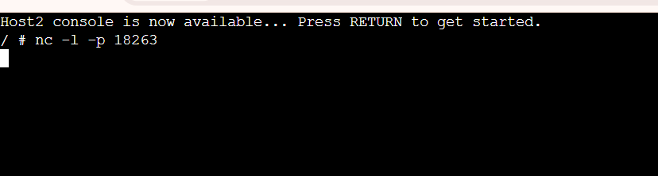
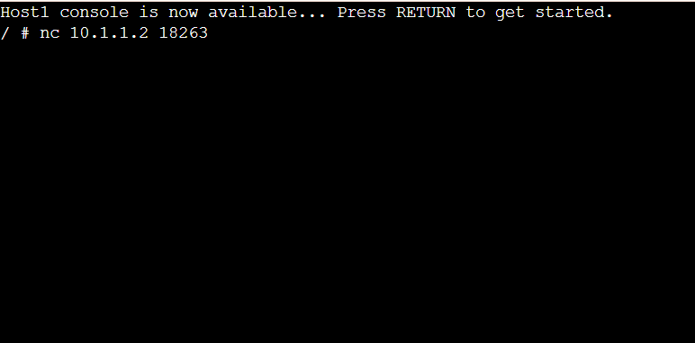
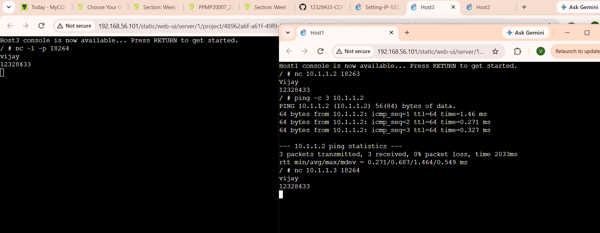
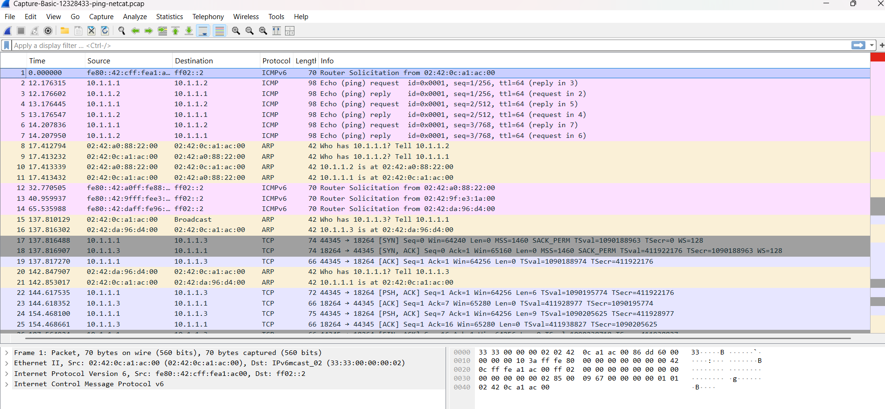

# Week 03 | Netcat and Packet Capture

## Overview

In this week's lab, I used **GNS3** to test application communication using Netcat and capture network packets using GNS3 packet capture.

## Task 1 - Netcat

I used two Linux Hosts to demonstrate client-server communication.

The server was started on Host 2 using:

```bash
nc -l -p 18263
```


The client on Host 1 connected using:

```bash
nc 10.1.1.2 18263
```


I sent my name from the client to the server and my student ID from the server to the client.


## Task 2 - Packet Capture

I started a packet capture on the link between Host 1 and the switch.

I then sent three ping requests from Host 1 to Host 2:

```bash
ping -c 3 10.1.1.2
```

I also used Netcat to send my name from Host 1 to Host 3.

The captured packets were saved as:

```text
Capture-Basics-12328433-ping-netcat.pcap
```

Below is the screenshot of consoles of Host 1 and Host 3 while packet capturing is being done:



### Pcap file in Wireshark

I have opened the pcap file that is captured in gns3 in Wireshark to verify it, and the output is :



## Reflection

This lab helped me understand application-level communication using Netcat and how GNS3 can capture network traffic for further analysis.
