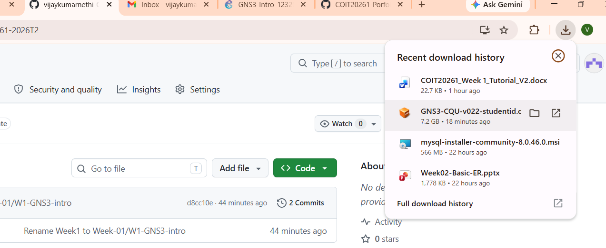
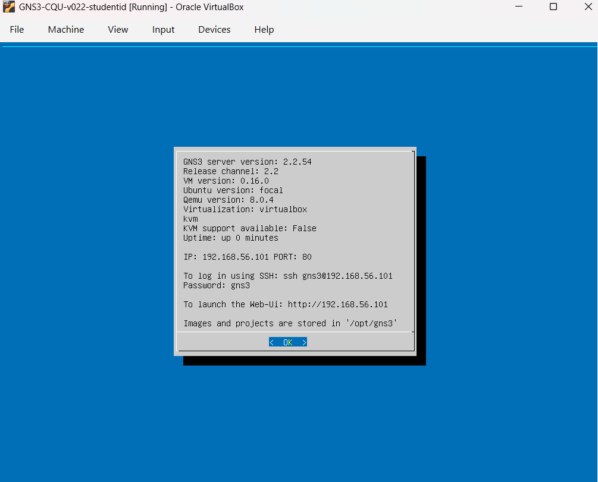
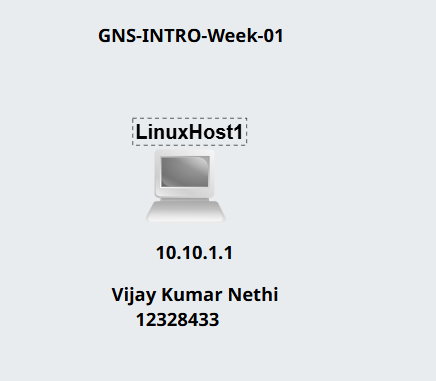
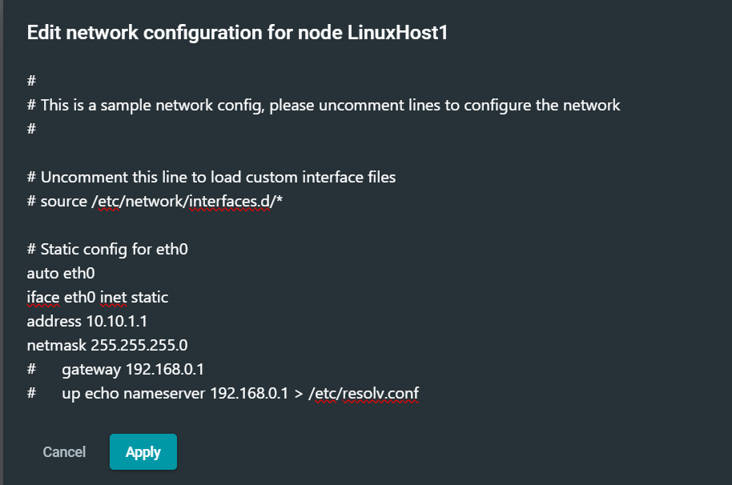

# Week 01 | Introduction to GNS3 Basics

## Overview

In this week's lab, I was introduced to **GNS3**, a network simulation and emulation platform used to create and test network configurations in a virtual environment.

The main objective of this activity was to create a Linux Host in GNS3, configure a **static IPv4 address**, and verify the configuration using Linux command-line tools.

This lab helped me understand the basic process of creating a virtual network device, configuring its network interface, and checking whether the assigned network settings were applied correctly.

---

## Key Concepts

A **static IP address** is manually assigned to a device instead of being automatically assigned by a DHCP server. Static IP addresses are useful for devices that need to be consistently reachable using the same address, such as servers and network infrastructure.

For this activity, I configured the Linux Host with the following network details:

- **IP Address:** `10.10.1.1`
- **Subnet Mask:** `255.255.255.0`
- **CIDR:** `/24`

I used Linux networking commands such as `ip address show` and `ifconfig` to view the network interface and verify the configuration.

---

## Lab Activities

The following tasks were completed during the lab:

1. Installed and configured GNS3.
2. Created a project workspace.
3. Added labels and descriptive text to the workspace.
4. Added a Linux Host node.
5. Configured a static IP address for the Linux Host.
6. Verified the configuration using Linux command-line tools.

---

# Evidence

## Step 1 - GNS3 Installation

I downloaded and installed **GNS3** and configured the GNS3 environment to work with the GNS3 virtual machine through VirtualBox.

After starting the virtual machine, I accessed the GNS3 web interface through the browser using:

`http://192.168.56.101/`

The following screenshot shows the GNS3 virtual machine running successfully.

---

## Step 2 - Workspace Configuration

I created a new project workspace in GNS3 and added descriptive text to make the purpose of the project easier to identify.

Next, I added a **Linux Host** to the workspace. I renamed the host and labelled it with the static IP address that I planned to configure.

The IP address used for the Linux Host was:

`10.10.1.1`

---

## Step 3 - Static IP Configuration

Before starting the Linux Host, I accessed the following network configuration file:

`/etc/network/interfaces`

>

I configured the network interface with the following static IP settings:

| Setting | Value |
|---|---|
| IP Address | `10.10.1.1` |
| Subnet Mask | `255.255.255.0` |

