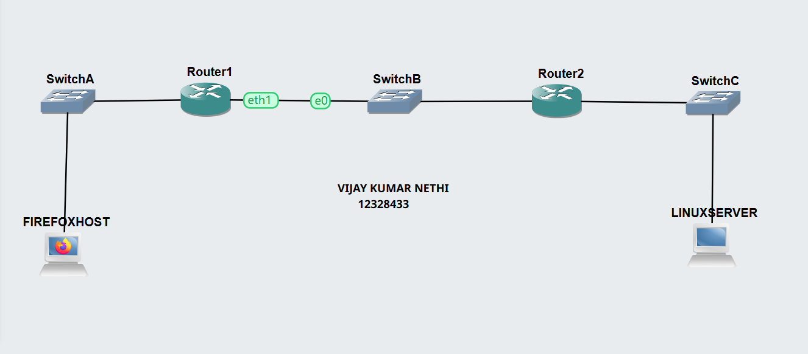

# Week 04 | HTTP Client with GUI and Command Line

## Overview

In this week's tutorial, I learned how HTTP clients communicate with a web server. I used a GUI web browser and command-line HTTP clients to access a Linux web server and observed the HTTP traffic using packet capture.

---

# Task 1 - HTTP Client with GUI

## Activities

I created a GNS3 project with three subnets connected using two routers. The first subnet contained a Firefox Host, the middle subnet connected the two routers, and the third subnet contained a Linux Server.

I configured static IP addresses and default gateways for the devices and tested connectivity using ping.

The topology was:

```text
Firefox Host → Router 1 → Router 2 → Linux Server
                  |
              Subnet B
```

I started packet capture on the link between the two routers. I then used the VNC client to open Firefox on the client host and accessed the website hosted by the Linux Server.

### Network Topology


