# Week 05 | Routing Tables and OSPF

## Overview

In this week's tutorial, I learned how to view routing tables and understand how routers forward packets between different networks. I also learned how OSPF dynamically selects routes and changes the path when a network link becomes unavailable.

---

# Task 1 - View Routing Tables

## Activities

I created a GNS3 project with three Linux Hosts, one Linux Router and one Ethernet switch. The network contained two different subnets.

I configured static IP addresses for the hosts and router interfaces and enabled IP forwarding on the router.

I used the following commands to check the network configuration and routing tables:

```bash
ip address show
ip route show
sysctl net.ipv4.ip_forward
```

I also used `ping` to test connectivity between hosts on different subnets.

### Network Topology

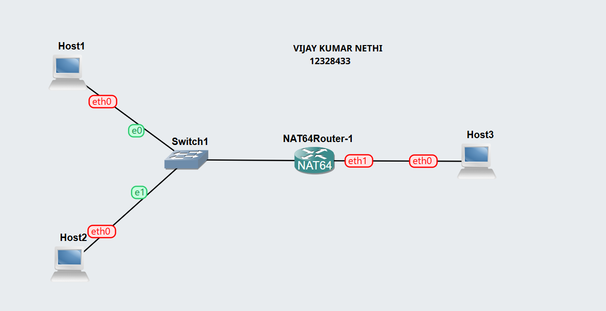

### IP Addresses and Routing Tables

Ip addresses and routing tables of each hosts and router is displayed below:


#### Host-1:
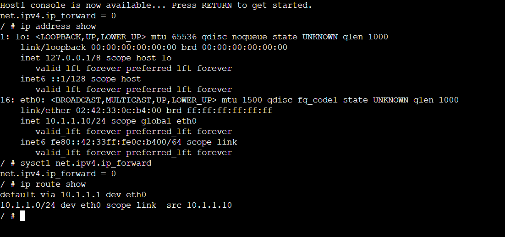

#### Host-2:
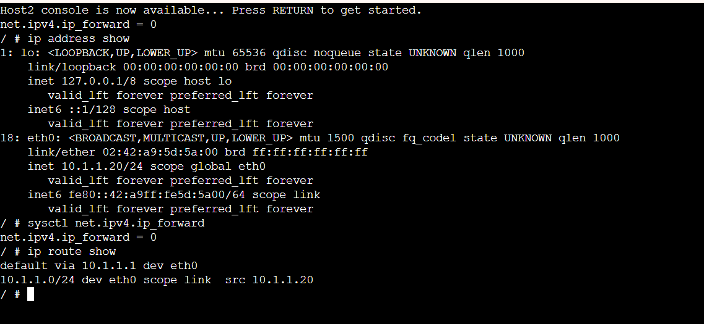

#### Router:
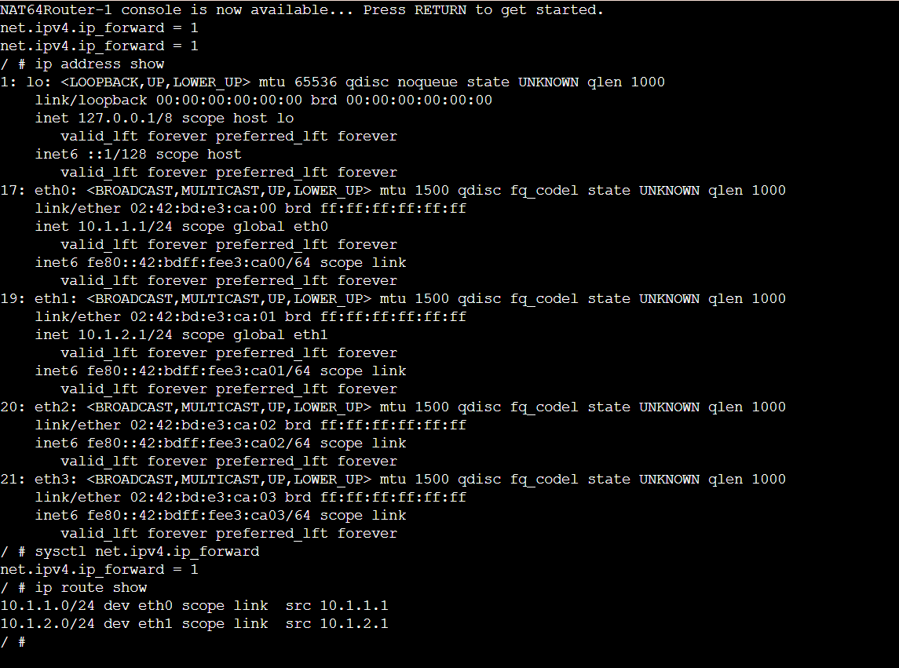

#### Host-3:
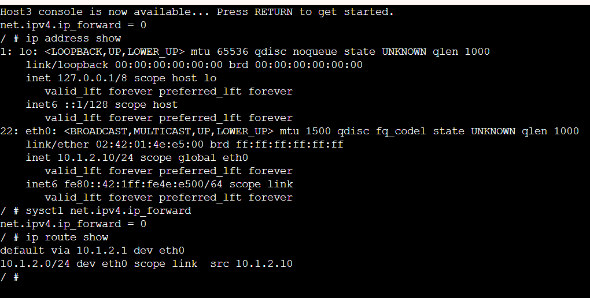

### Successful Ping

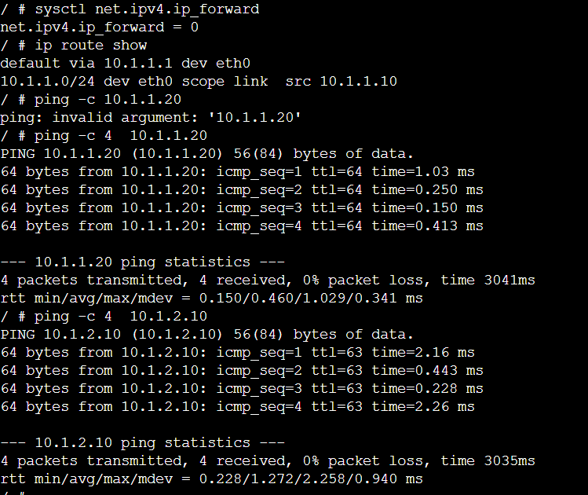

---

# Task 2 - Dynamic Routing with OSPF

## Activities

I used the provided OSPF template containing two hosts, four FRR routers and two NETem nodes. The IP addresses and OSPF configuration were already provided in the template.

The topology provided two possible paths between Host1 and Host2.

The two paths were:

```text
Host1 → FRR-1 → FRR-3 → NETem2 → FRR-4 → Host2
```

and

```text
Host1 → FRR-1 → FRR-2 → NETem1 → FRR-4 → Host2
```

I used the following FRR commands to view OSPF and routing information:

```text
show ip ospf neighbor
show ip ospf route
show ip route
```

### OSPF Topology

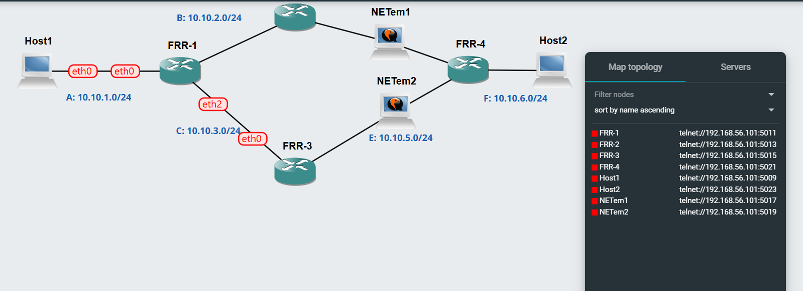

### OSPF Neighbours

I used `show ip ospf neighbor` on FRR-1 to view its neighbouring routers.

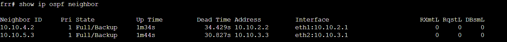

### Routing Information

I used `show ip ospf route` and `show ip route` to view the routes maintained by OSPF and the Linux routing table.

#### OSPF Route Table of FRR-1:

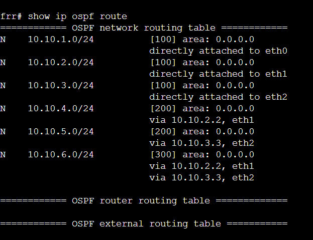

#### Route Table of FRR-1:

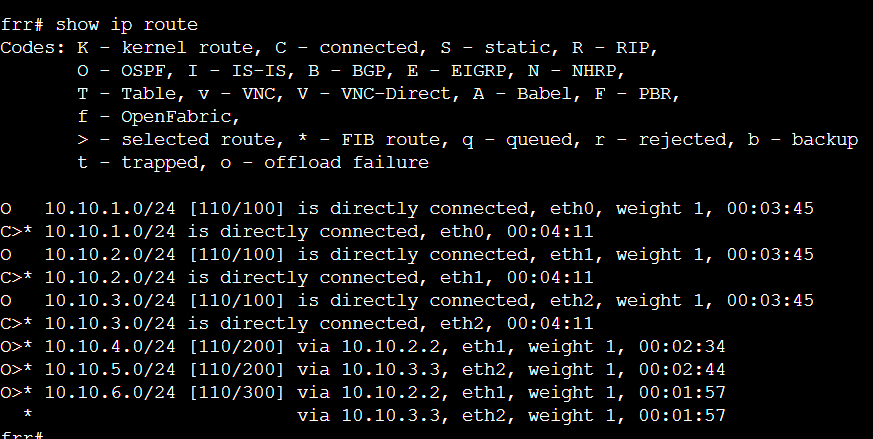

#### Route Table of FRR-2:

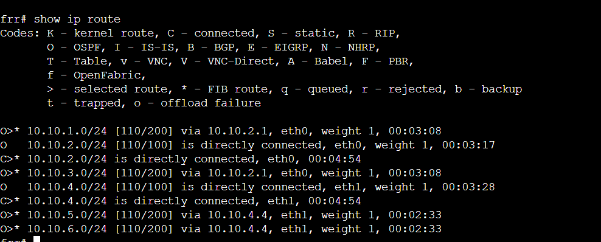

#### Route Table of FRR-3:

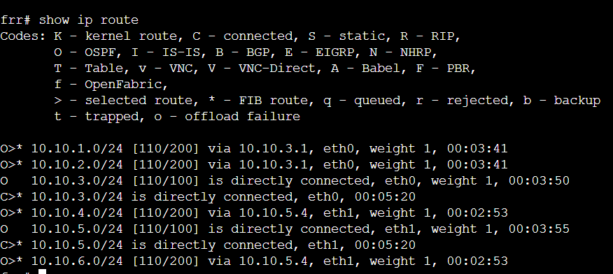

#### Route Table of FRR-4:

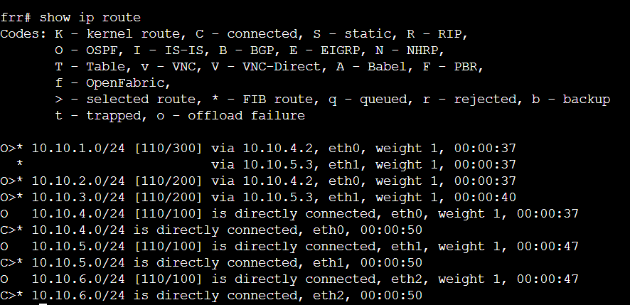


### Traceroute Before Link Failure

I used `traceroute` from Host1 to Host2 to identify the path currently selected by OSPF.

```bash
traceroute 10.10.6.102
```

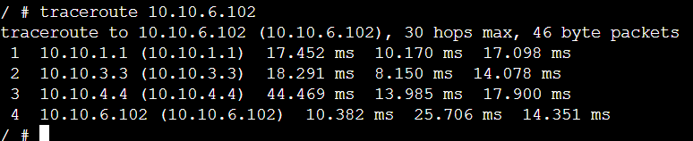

### Link Failure

I stopped the NETem node (i.e NETem2) that was part of the active path between Host1 and Host2.

OSPF detected the link failure and selected the alternative available path.

### Traceroute After Link Failure

I ran traceroute again from Host1 to Host2 to observe the new path selected by OSPF.

```bash
traceroute 10.10.6.102
```

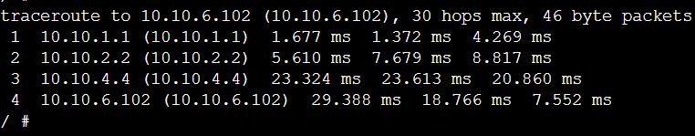

---

## Reflection

This week's tutorial helped me understand how routing tables are used to forward packets between different networks. I also learned how OSPF uses dynamic routing to select a path and automatically change to an alternative path when a link becomes unavailable.

Overall, the activity gave me practical experience with routing tables, OSPF neighbours and traceroute in GNS3.
