# Week 02 | Static IP Address Configuration and Ping

## Overview

In this week's lab, I used **GNS3** to create a LAN with four Linux Hosts and an Ethernet switch. I configured static IP addresses using three different methods and tested network connectivity using `ping`.

## Network Configuration

* **Network:** `10.1.1.0/24`
* **Subnet Mask:** `255.255.255.0`

| Host   | IP Address    | Configuration Method      |
| ------ | ------------- | ------------------------- |
| Host 1 | `10.1.1.1/24` | GNS3 Configure            |
| Host 2 | `10.1.1.2/24` | GNS3 Configure            |
| Host 3 | `10.1.1.3/24` | `/etc/network/interfaces` |
| Host 4 | `10.1.1.4/24` | `ip address add`          |

## Task 1 - Setting Static IP Addresses

### Network Topology

Four Linux Hosts were connected to one Ethernet switch to create a LAN.

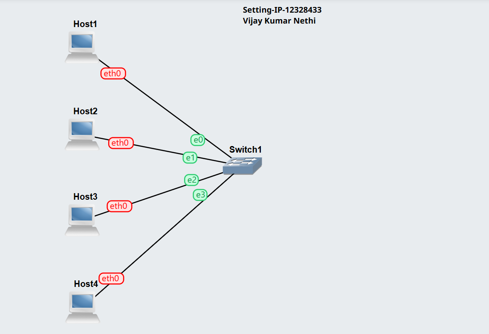

### Host 1 Configuration

I configured Host 1 directly using **GNS3 Configure interface**


### Host 2 Configuration

I also configured Host 2 directly using **GNS3 Configure interface**

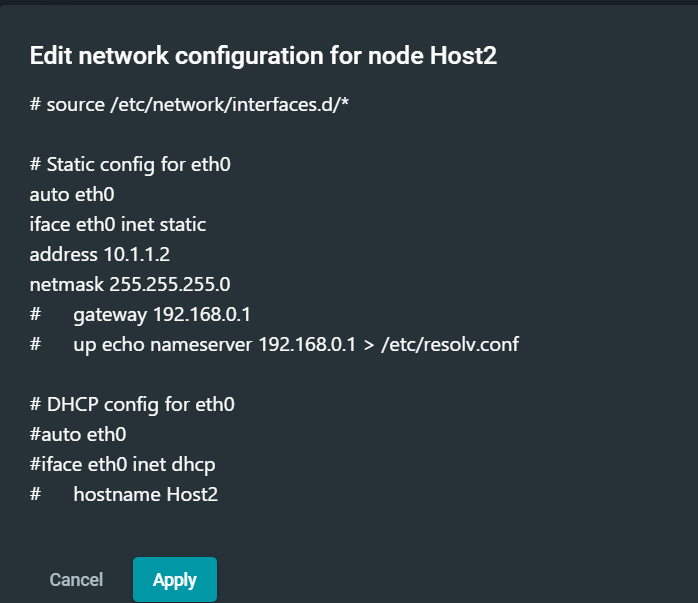

### Host 3 Configuration

I configured Host 3 using the `/etc/network/interfaces` file:

```bash
nano /etc/network/interfaces
```

```text
auto eth0
iface eth0 inet static
    address 10.1.1.3
    netmask 255.255.255.0
```
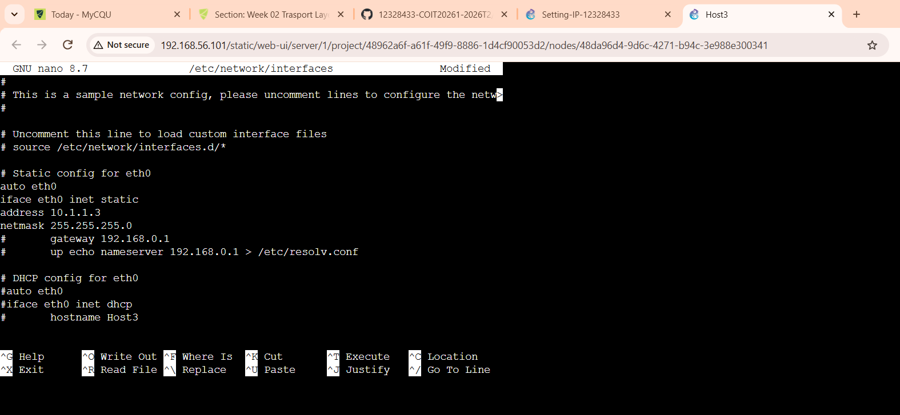

I then reloaded the interface:

```bash
ifdown eth0
ifup eth0
```

### Host 4 Configuration

I configured Host 4 using:

```bash
ip address add 10.1.1.4/24 dev eth0
```
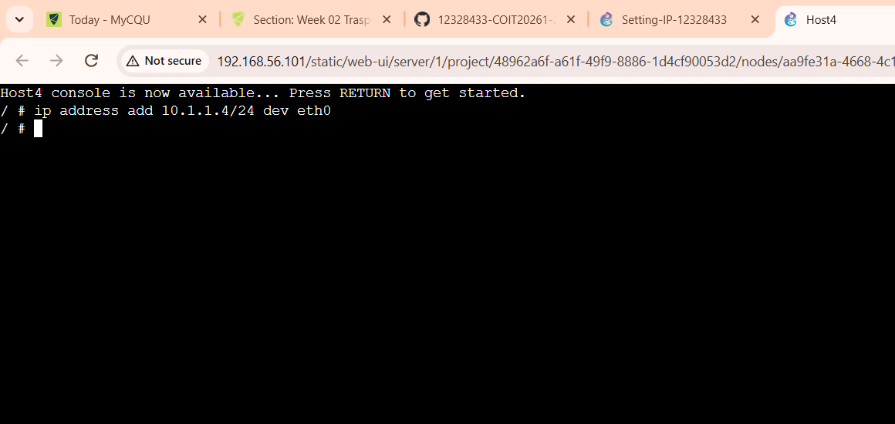

### IP Address Verification

I verified the IP address on each host using:

```bash
ip address show
```

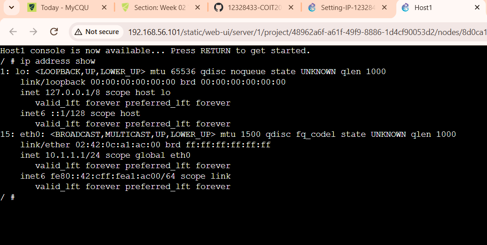

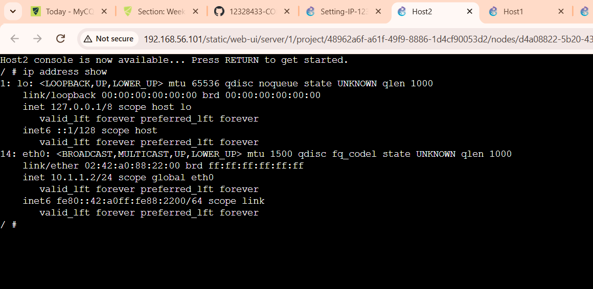

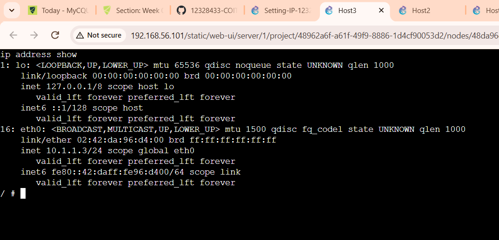

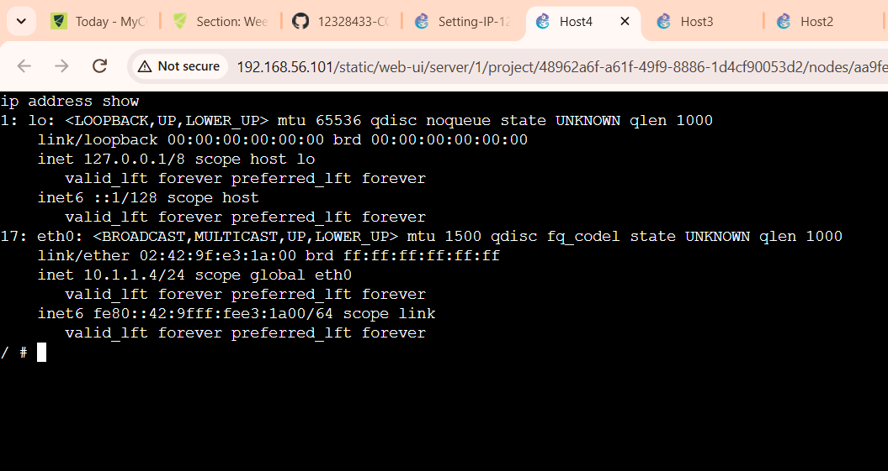

## Task 2 - Testing Network Connectivity

### Basic Ping

I tested connectivity from Host 1 to Host 2:

```bash
ping 10.1.1.2
```

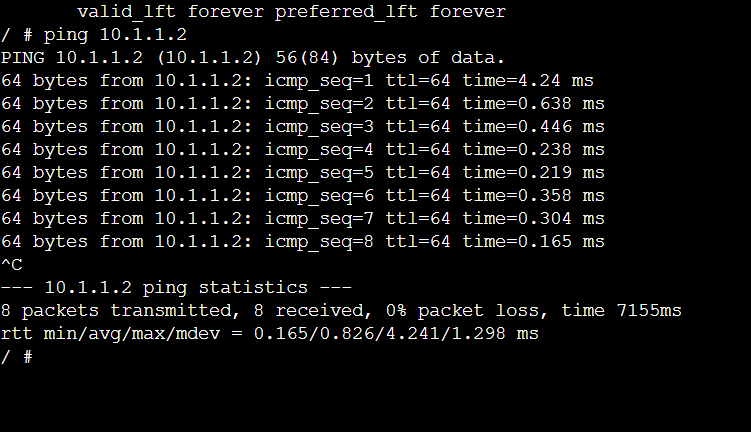

The output showed the replies, packet loss and round-trip time (RTT).

### Ping to an Incorrect IP Address

I tested an IP address that was not assigned to any host:

```bash
ping 10.1.1.100
```

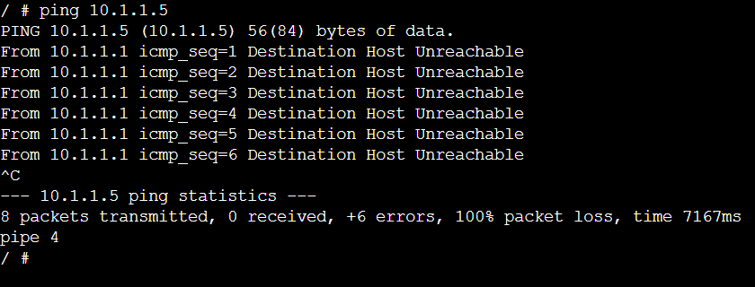

### Ping with Options

I tested ping using different options:

```bash
ping -c 3 -i 2 -s 100 10.1.1.2
```

* `-c 3` = sends 3 packets
* `-i 2` = 2-second interval
* `-s 100` = 100-byte packet size

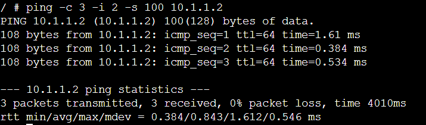

## Reflection

This lab helped me understand different methods of configuring static IP addresses in Linux. I also learned how to verify IP configurations using `ip address show` and test network connectivity using `ping`.
